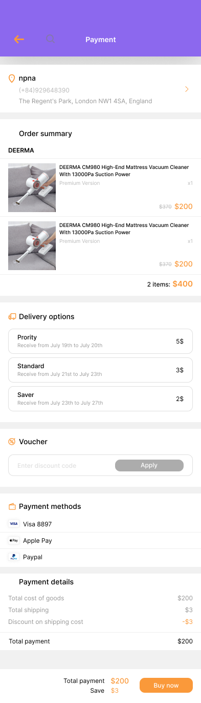

# E-Commerce App - Ứng dụng Thương mại Điện tử


## 📱 Giới thiệu

E-Commerce App là một ứng dụng thương mại điện tử di động được phát triển bằng Flutter và Firebase. Ứng dụng cung cấp trải nghiệm mua sắm trực tuyến có các tính năng cơ bản, cho phép người dùng duyệt sản phẩm, thêm vào giỏ hàng, thanh toán và theo dõi đơn hàng.

## ✨ Tính năng chính

- **Xác thực người dùng**: Đăng ký, đăng nhập, quên mật khẩu
- **Trang chủ**: Hiển thị banner quảng cáo, sản phẩm nổi bật, flash sale và danh mục sản phẩm
- **Tìm kiếm sản phẩm**: Tìm kiếm theo tên sản phẩm
- **Chi tiết sản phẩm**: Xem thông tin chi tiết, hình ảnh, giá cả, đánh giá và sản phẩm liên quan
- **Giỏ hàng**: Thêm, xóa, cập nhật số lượng sản phẩm
- **Đặt hàng**: Chọn địa chỉ giao hàng, phương thức vận chuyển và thanh toán
- **Quản lý đơn hàng**: Xem lịch sử và trạng thái đơn hàng
- **Hồ sơ người dùng**: Quản lý thông tin cá nhân và địa chỉ


## 🛠️ Công nghệ sử dụng

- **Flutter**
- **Firebase**:
    - **Authentication**: Xác thực người dùng
    - **Firestore**: Cơ sở dữ liệu NoSQL
    - **Cloud Storage**: Lưu trữ hình ảnh và tài nguyên
- **Provider**: Quản lý trạng thái ứng dụng
- **Carousel Slider**: Hiển thị banner và sản phẩm dạng slide
- **Flutter Rating Bar**: Hiển thị đánh giá sản phẩm
- **Cached Network Image**: Tối ưu tải và hiển thị hình ảnh

## 📂 Cấu trúc dự án

```
lib/
├── core/
├── data/                  # Lớp dữ liệu và models
├── model/                 # Các model dữ liệu
│   ├── Cart/              # Model giỏ hàng
│   ├── order/             # Model đơn hàng
├── presentation/          # Các màn hình UI
│   ├── cart_screen/       # Màn hình giỏ hàng
│   ├── detail_screen/     # Màn hình chi tiết sản phẩm
│   ├── home_screen/       # Màn hình trang chủ
│   ├── orders_screen/     # Màn hình đơn hàng
│   ├── profile_screen/    # Màn hình hồ sơ người dùng
│   ├── sign_in_screen/    # Màn hình đăng nhập
│   ├── sign_up_screen/    # Màn hình đăng ký
│   ├── splash_screen/     # Màn hình khởi động
├── routes/                # Định nghĩa các route
├── services/              # Các dịch vụ
│   ├── Database/          # Dịch vụ tương tác với Firestore
│   ├── provider/          # Các provider quản lý trạng thái
├── shared/                # Các thành phần dùng chung
├── theme/                 # Định nghĩa theme và style
├── widgets/               # Các widget tái sử dụng
├── firebase_options.dart  # Cấu hình Firebase
├── main.dart              # Điểm khởi đầu ứng dụng
```

## 📱 Màn hình ứng dụng

### Splash Screen & Onboarding

| Splash Screen | Onboarding Screen | Welcome Screen |                                 SignIn Screen                                  |
|:-------------:|:-----------------:|:--------------:|:------------------------------------------------------------------------------:| 
|  |  |  |  |


### Trang chủ & Tìm kiếm

| Home Screen | Search Screen |
|:-----------:|:-------------:|
|  |  | 

### Chi tiết sản phẩm 

| Product Detail |
|:--------------:|
|  |

### Thanh toán & Đặt hàng

| Payment Screen | Choose Location | My Orders |
|:--------------:|:---------------:|:---------:|
|  |  |  |


## 🚀 Cài đặt và chạy dự án

### Yêu cầu

- Flutter SDK (phiên bản 3.4.3 trở lên)
- Dart SDK (phiên bản tương thích với Flutter)
- Android Studio hoặc VS Code
- Thiết bị Android/iOS hoặc máy ảo

### Các bước cài đặt

1. **Clone dự án**
   ```bash
   git clone https://github.com/your-username/E_ecommerce_app.git
   cd E_ecommerce_app
   ```

2. **Cài đặt các dependencies**
   ```bash
   flutter pub get
   ```

3. **Cấu hình Firebase**

4. **Chạy ứng dụng**
   ```bash
   flutter run
   ```

## 🔒 Bảo mật

- Xác thực người dùng an toàn thông qua Firebase Authentication
- Bảo vệ dữ liệu người dùng với quy tắc bảo mật Firestore

